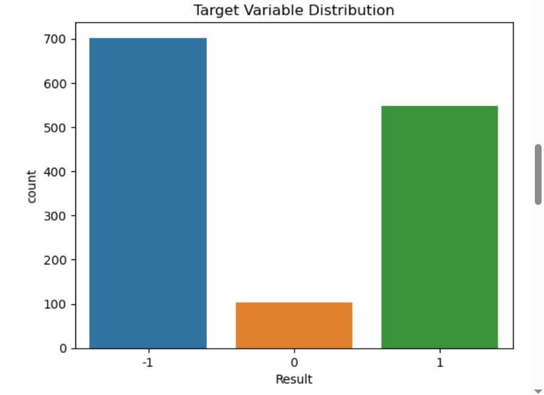

# 🛡️ Phishing Website Classification using Machine Learning

## 📊 Overview

This project applies machine learning techniques to detect phishing websites using behavioral features. The model classifies websites as:

- **1** → Phishing (Malicious)  
- **0** → Suspicious (Neutral)  
- **-1** → Legitimate (Safe)

Built using Python, this project showcases skills in data analytics, EDA, and predictive modeling with Decision Trees.

---

## 📁 Dataset

- **Source**: [UCI Phishing Websites Dataset](https://archive.ics.uci.edu/dataset/379/website+phishing)  
- **Instances**: 1,353  
- **Features**: 9 behavior-based predictors  
- **Target**: `Result` column with values -1, 0, or 1

Key features include:
- Pop-up behavior  
- SSL Certificate status  
- Domain age  
- IP tracking behavior  
- URL structure

---

## 🧰 Technologies Used

- Python 3.x  
- Pandas, NumPy  
- Seaborn, Matplotlib  
- Scikit-learn  
- `liac-arff` for loading `.arff` files  

---

## 🧪 Methodology

1. **Data Loading**  
   - Parsed `.arff` file and created a DataFrame

2. **Data Cleaning**  
   - No missing values found  
   - Duplicates retained as they reflect realistic web behavior

3. **Exploratory Data Analysis (EDA)**  
   - Feature distribution visualization  
   - Standard deviation checks for feature relevance

4. **Modeling**  
   - Trained a Decision Tree classifier  
   - Evaluated performance using accuracy, confusion matrix

---

## 📈 Results

| Metric        | Value     |
|---------------|-----------|
| Accuracy      | *e.g., 92%* |
| Precision     | *e.g., 91%* |
| Recall        | *e.g., 93%* |

## 📷 Key Visualizations

### 🎯 Target Variable Distribution

### 🌳 Decision Tree Visualization

